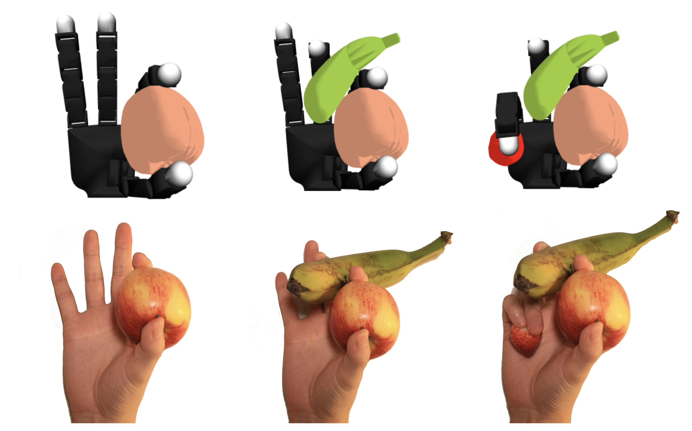
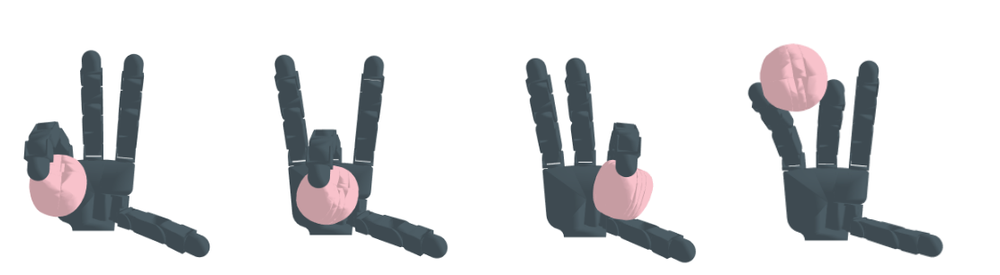

# Grasping a Handful: Sequential Multi-Object Dexterous Grasp Generation

This repository contains the PyTorch implementation of SeqGrasp. 

We introduce the sequential multi-object robotic grasp sampling algorithm SeqGrasp that can robustly synthesize
stable grasps on diverse objects using the robotic hand’s partial Degrees of Freedom (DoF). We use SeqGrasp to construct the
large-scale Allegro Hand sequential grasping dataset SeqDataset and use it for training the diffusion-based sequential grasp
generator SeqDiffuser. We experimentally evaluate SeqGrasp and SeqDiffuser against the state-of-the-art non-sequential multi-
object grasp generation method MultiGrasp in simulation and on a real robot. The experimental results demonstrate that SeqGrasp
and SeqDiffuser reach an 8.71%-43.33% higher grasp success rate than MultiGrasp. Furthermore, SeqDiffuser is approximately 1000 times faster at generating grasps than SeqGrasp and MultiGrasp. 


[Paper](https://ieeexplore.ieee.org/abstract/document/11177174) |
[ArXiv](https://arxiv.org/abs/2503.22370) |
[Project](https://yulihn.github.io/SeqGrasp/) |
[Dataset](https://huggingface.co/datasets/YuLLi/SeqGrasp)

<div align="center">

</div>
Published in: IEEE Robotics and Automation Letters


## Installation

1. Create a conda environment

```
conda create -n sgrasp python=3.8
conda activate sgrasp
```
2. Install pytorch3d
```
pip install torch==1.11.0+cu113 torchvision==0.12.0+cu113 torchaudio==0.11.0 --extra-index-url https://download.pytorch.org/whl/cu113

pip install fvcore

pip install --no-index --no-cache-dir pytorch3d -f https://dl.fbaipublicfiles.com/pytorch3d/packaging/wheels/py38_cu113_pyt1110/download.html
```
3. Install torchsdf
```
cd thirdparty
git clone https://github.com/wrc042/TorchSDF.git
cd TorchSDF
git checkout 0.1.0
bash install.sh
```
4. Install dependencies
```
pip install transforms3d trimesh pytorch_kinematics urdf_parser_py plotly loguru scipy rtree tensorboard
```
5. Install [IsaacGym](https://developer.nvidia.com/isaac-gym)


## Grasp Generation & Test & Visualization

generate grasps (set guid_scale to use EGD)
```
cd grasp_generation
python main_seq.py
```

test grasps in isaacgym
```
python isaac_test.py --eval_dir path_to_grasps
```

visualize the results
```
python tests/visualize_result.py
```

Some examples generated by SeqGrasp
<div align="center">

</div>

## Acknowledgments
This work was supported by the Swedish Research Council, the Knut and Alice Wallenberg Foundation, the European Research Council (ERC-BIRD-884807). The authors also would like to express their sincere gratitude to Li Chen for valuable assistance with the experimental hardware and to Ning Zhou for contributing an RTX 3090 graphics card.

## Citation
If you want to cite us:
```
@misc{lu2025graspinghandfulsequentialmultiobject,
      title={Grasping a Handful: Sequential Multi-Object Dexterous Grasp Generation}, 
      author={Haofei Lu and Yifei Dong and Zehang Weng and Florian Pokorny and Jens Lundell and Danica Kragic},
      year={2025},
      eprint={2503.22370},
      archivePrefix={arXiv},
      primaryClass={cs.RO},
      url={https://arxiv.org/abs/2503.22370}, 
}
```


## License

This project is licensed under the MIT License. See [LICENSE](LICENSE) for more details.


